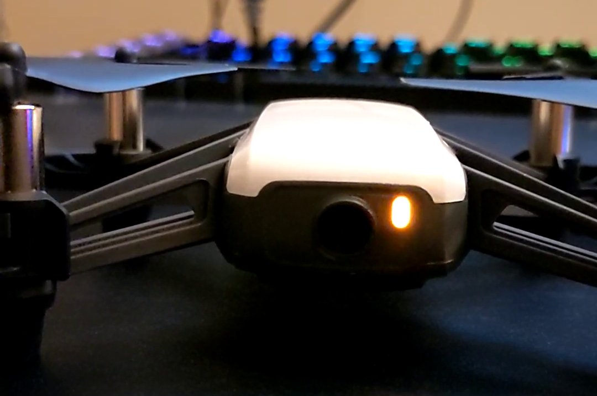
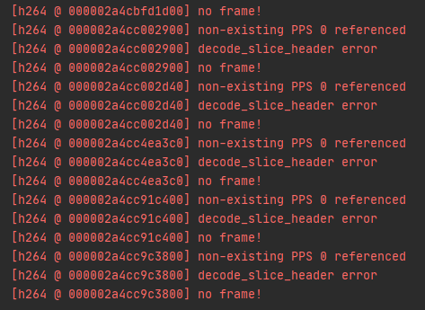
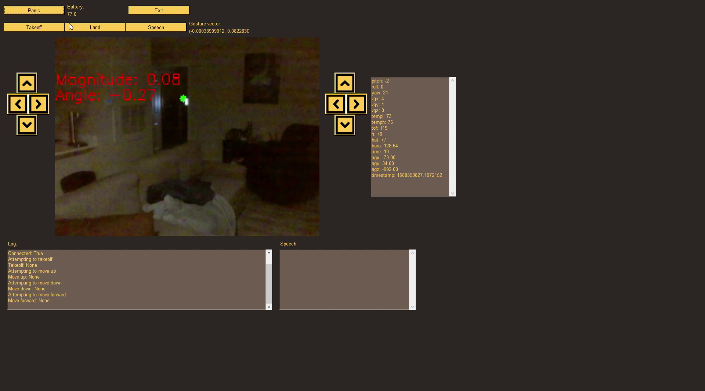

AutoDrone
===========================

This project was originally undertaken to fulfill the requirements for a graduate level independent study towards the completion of the Master's of Computer Science at Rochester Institute of Technology.

- [AutoDrone Proposal](docs/reports/AutoDrone_proposal.pdf)
- [AutoDrone Writeup](docs/reports/AutoDrone_writeup.pdf)

## License

See the [LICENSE file](LICENSE) for license rights and limitations (MIT).

## Overview

Most small, DIY drones are configured to be controlled completely from either a remote control or from an on-drone auto-pilot. The former are generally limited by the number of control channels on the transmitter, and the pilot must have some method for observing the environment in which the drone is operating. The latter configuration is limited by the power and resources provided by the on-board computer. The most important resources, computational capability and power, are typically heavy and expensive, making resource management and system addons a critical design decision. Can a camera be added to the board without overly taxing the already limited processing power? What about a tracking algorithm? Many approaches for these problems are becoming more and more resource demanding, such as training of neural networks or running reinforcement learning agents, and so a different configuration might be better suited to building an extensible and scalable flight control system.

The ultimate goal pursued during this project was two-fold: to explore machine learning and control systems on a resource-constrained system and to offer practical experience into the design decisions required for building such a system. An additional benefit is the end-creation of a computer controlled drone which can be readily extended for control by other control mechanisms, such as BCIs or VR headsets.

This project bears similarity to CSCI-632, Mobile Robot Programming. However, this project differs in that flight offers a particular set of challenges compared to ground-based navigation. Where ground-based navigation effectively operates in a confined, 2D space, flight systems operate in a 3D environment. This differentiating factor is also a challenge for humans first learning to fly. Apparently, the best response to going into a power-on stall is not to go full lean on the mixture, unless you're looking to terrify your CFI. Beyond that, resource management is vastly more important when controlling a system in the air. When on the ground, if power runs out, you can simply pull to the side of the road or park where ever you may happen to be. In the case of flying, this option is tantamount to crashing.

## Dependencies

### [Kivy](https://kivy.org/)

#### [Windows](https://kivy.org/doc/stable/installation/installation-windows.html)

```
python -m pip install docutils pygments pypiwin32 kivy_deps.sdl2==0.1.* kivy_deps.glew==0.1.*
python -m pip install kivy_deps.gstreamer==0.1.*
python -m pip install kivy==1.11.1

# optional
python -m pip install kivy_examples==1.11.1

# test
python kivy_venv\share\kivy-examples\demo\showcase\main.py
```

## Drone

The original intent of the project was that I would create a drone from scratch, as this would allow me complete control over all the inner-working and communication protocols involved with controlling the drone. This approach started off going well until Amazon experiences several issues with shipping parts I needed to build the drone. Needless so say, I took a step back and re-evaluated where I was and what I was looking to accomplish. I had intended to work on both sides of the problem: the drone and the control system, but this delay set me back as I had to find another drone that I could communicate with and control wirelessly, or I had to build a way to simulate the drone and the environment.

### Tello Drone

Enter stage left: the Tello drone. This seemed to be a suitable replacement for what I was looking for, and at just a little over $100, it didn't hurt too much. The little toy below arrived fairly quickly, and I got to it, scrapping the majority of the prep work I had done for building the drone. That could save for a rainy day.



I hit the first snag fairly quickly: the coding environment. DJI's official library and all of their examples are written in either Scratch or Python 2.7. That just wouldn't do. But there were several other reference libraries I could look at, and DJI has an SDK document that documents the commands and how the drone is supposed to react to those commands.

#### Implementation Details

The drone expects messages to be sent over UDP to port 8889, and it responds over several ports (8889, 8890, and 11111) based on what it is sending to the host system. Port 8889 is for responding to messages, 8890 is dedicated to a state stream, and 11111 is for the video stream. That all seems to be reasonable until you get in to actually using their implementation. The first issue is with regards to how it responds to commands. Being as it's UDP, we have no guarantee that a packet does not drop or arrive out of order, and in fact, this appears to not be a completely atypical occurrence. This would be fine if each message had an associated ID or some way to correlate commands to responses, but the only response the drone ever seems to actually send back is `ok` or `error`. After playing with several solutions, the easiest solution was to space out sending messages where the response was critical. This was made easier by the fact that most of the actual *critical* messages are sent during initialization, not during actual flight. Thus, the system allows to send a message and either expect or response or not. It also keeps track of how many messages are sent that do not expect a response, so it might be theoretically possible to back-correlate which response goes with which message, but this presented much more of a headache than warranted and wasn't really all that important of an issue to solve. So, as with any good software engineering hurdle that you don't want to solve, you mark it as *out-of-scope* and move on.

Using UDP presents one more issue that was largely not anticipated. It would seem reasonable to use UDP for a video stream. If we lose several packets, meh, not the end of the world. Expect for that it is streaming the video in FFMPEG. Dealing with the issues that arose, I learned that FFMPEG apparently doesn't transmit in full frames, and so if several frames are dropped, this causes errors in decoding the video stream. And given the low-resource nature of the drone, frames could be dropped fairly regularly, as previously noted, but not necessarily consistently. Sure, suppress the error and move on to the next part of the project. Except that the underlying library in Python best suited to the task (OpenCV), is written is C++. The Python calls are bindings to the C++ library, meaning that these rather annoying error messages couldn't be simply suppressed without rewriting several portions of the underling library and recompiling the source. Not a light task for such a massive library, especially on a Windows host. In the end, it's annoying, as shown below, but it doesn't actually break anything. The stream can be read and the frames saved into a video.



The final large issue with the Tello implementation is with respect to the actual SDK. It turns out that it's just wrong. Well, mostly wrong. There are a few parts that are right, such as the majority of sending and receiving messages. However, one little tip: the latest SDK only pertains to a particular model of the Tello drone: Tello EDU, not the base model. And the base model's firmware can't be upgraded to support the latest SDK, but I can't find any official reference to this fact. Again, however, this wasn't too major of a concern. The drone just responds with an error when you send an incorrect command. So... simply don't send that command.

Until you get to the control methods. They all respond as if everything is working properly, but the drone doesn't actually move. The actual docstring for the `TelloDrone.py` module describes this a bit more in detail, but most of the `control` commands don't have any effect. Instead, the drone should be controlled through use of the `rc` command, which takes 4 integer values as parameters. These parameters set the speed of various control surfaces on the drone and effectively operate as if you were using a typical remote control.

Sorting out these issues is, admittedly, still a work in progress. Mostly in making the operation of the drone stable. Connecting to the drone's broadcasted network can be a bit finicky, and if anything goes wrong in any portion of the code, it may leave the drone in a state where the easiest solution is to just hard-reboot the drone and go through connecting to it's network. Version 2.0 of the SDK details being able to configure the drone to connect to a wi-fi network rather than having to connect to the drone's network. But this is not an option for version 1.3, which is the version supported by the base Tello model.

## ControlGui

The main benefit of the control GUI comes in that it is a single place to perform integration testing. It has the added benefit of it's aesthetic appeal, as is clear in the below figure.



The actual GUI consists of only several sub-components: the control methods, the diagnostic information, and the logging mechanism. The control methods can be further broken down into two sub-categories: simple controls and complex controls. The simple controls are those which offer a labeled button to perform that action. e.g. Connect, takeoff, land. The complex controls are those on that would equate to the toggle sticks on a traditional remote control. e.g. Up, down, left, right. While a rather arbitrary distinction, as both types can be controlled by any of the input mechanisms (keyboard, mouse, speech, etc), the complex controls can be extended to operate in a stateful manner. The current, most stable implementation simply sends an `rc` command to the drone which corresponds to the control selected. However, if state were to be tracked with regards to the accumulation of inputs to these controls, varying levels of speed could be set for each axis of control. In the current configuration of the input methods, this was found to be rather unstable. Partially, this was also due to the fact that the keyboard input currently only detects key-up events as this was the only option provided by the GUI framework in use. This is simple enough to change out, but the effort involved was better spent solving other, larger and more interesting problems. This is left as an exercise to the reader.

The other interesting part of the GUI is the video display. The diagnostic information just shows the current state of the drone. Whoo-hoo. Battery is getting low. Acceleration is downwards because it's on Earth. Useful, but not particularly interesting. The video, however, requires several moving parts to get working. The first is because the drone and the gesture module don't actually communicate directly. Nor do they know about each other in any capacity. Instead, the frames all pass through the GUI, which is acting as the controller in this capacity, from the drone to the gesture recognition module. The controller then performs several other actions and then asks the gesture module for the latest information about the last frame it sent over. It pulls this information back and displays it to the user on the graphic screen, along with some computed metrics including the optical flow vector, which is explained in detail in the next subsection.

## Future Work

In no way is this project in a stable or complete form. A lot of work remains, both with regards to the hardware and software components involved. The below suggestions are potential areas to expand upon the provided functionality, but many other ideas exist as well. A further set of future tasks, both long and short term, exist in the \textit{roadmap.txt} file located in the github repo.

### Hardware

The hardware can take a few different paths, and the path chosen also impacts the software component of the project. At a high-level, the distinction lies in pursuing a solitary agent or bringing in several friends to build a swarm of drones.

#### Custom Drone

Taking the solitary approach, the first step would be to try and distance myself from the Tello drone. Maybe see how well it can dodge a hammer. But the main issue is with regards to its stability and lack of an effective communication protocol from the drone to the host system. Given less of a time constraint, time should most certainly be spent on this aspect to ensure a stable, robust, and configurable drone. Hopefully for less than the price tag associated with the Tello base model.

#### Drone Swarm

An interesting take on the problem is to deploy a swarm of drones rather than a single agent. This would still require developing a custom drone, but these would all be much smaller, meaning they would also be less stable in flight. To operate as a swarm, they would require additional sensors compared to the single agent. More sensors means more weight, more power, and a greater computational drain. Sourcing of effective parts would be much more paramount and would likely benefit from development of a simulation environment prior to physically building the physical drone.

### Software

As the hardware evolves, so must the software. Beyond updating the control methods to account for a custom drone, there are better techniques able to be used to address some of the issues faced with the current approach.

#### Motion Tracking

One of the easier tasks to handle may be to implement various tracking algorithms. OpenCV offers several out of the box, and these could be used to replace the gesture recognition with a higher degree of fidelity. Using optical flow estimation may be able to be expanded to account for an overall energy shift in subsequent frames, allowing for accounting for the shifting reference frame when the drone moves. But even this alteration could benefit from a more accurate and robust tracking mechanism. There's nothing requiring only a single processing technique to give the system the information it requires.

#### Pose Estimation

Along with tracking algorithms, pose estimation of the target could benefit the system in not only seeing where the target is moving, but where it will likely move in a 3D environment. People often make subtle movements prior to actually moving, and if those movements are able to be tracked and estimated, the drone may be able to anticipate the movement and react accordingly. This would be particularly useful in deploying the drone to help protect you during HvZ. No more getting caught off guard by those pesky zombies.

#### Monocular Depth Estimation

A large limitation of the current method of preforming the gesture recognition is that it cannot detect depth. In many applications, this is solved through use of using multiple images taken at various angles and computing the stereo depth of the image. The drone would be able to move around to take multiple shots, but this would fail rather spectacularly here. It makes a fatal assumption in that it assumes the target is not moving. It may be possible to use a stereo type approach with a swarm, similar to using a friend to tell you how far back to move the claw in the arcade claw game. But still, it would be preferable to be able to have a single drone perform the depth estimation rather than using multiple drones, meaning additional resources, to perform this same task. This is where monocular depth estimation comes into play. Recent papers show promising results, at least in a lab environment. Transferring it to a real-world application may prove challenging.

% custom speech recognition module


## Tello LED Sequences

Upon initially turning on the Tello drone, the indicator led will blink green and then flash red for about 1 second. It will then switch off for another second, and then proceed to blink a series of colors. Eventually, it will continually flash yellow. At this point, the drone should be broadcasting its wifi network and you should be able to connect to it from your computer's network settings.

[A video of this sequence is located in the `docs` folder.](docs/indicator_led_sequence.mp4)

When the GUI or CLI utilities are run, they will send 'command' to the drone. This specific string tells the drone to switch to sdk mode, allowing us to use our program to send commands to control the drone. The utilities keep sending this command on a 1 second interval until the receive an 'ok' message, indicating that the drone has successfully received the command. At this point, the utility has established a connection to the drone, and the user is able to interactively send control the Tello drone from the utility's interface.

Note that none of this comes from official documentation. These are purely inferred from my experience working with the Tello drone base model.
TODO Disclaimer about these having been inferred

- Broadcasting wifi network
- Green - SDK mode

### Command descriptions
